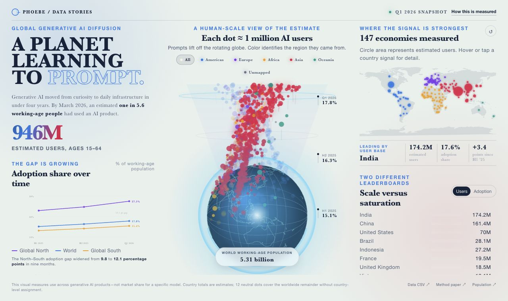

<!-- phoebe header -->

### ▶︎ [Open the live gallery →](https://phoebefu6.github.io/design-dashboard-with-phoebe/)

Free and open. Every build links to its source.

<!-- /phoebe header -->
Phoebe designs and ships dashboards across industries.

This is a growing collection of dashboard experiments across ecommerce, healthcare, education, finance, HR, aquaculture, technology, and whatever problem space feels interesting next. Each one tries a different mix of layout, chart language, interaction, density, color, and data story based on the industry and the decision it needs to support.

If you are into data visualization too, come explore the work. Maybe we build something fun together with Claude Code, Codex, and a good metric model.

**[Launch the featured AI Adoption Signal Atlas live demo →](https://phoebefu6.github.io/design-dashboard-with-phoebe/Technology/ai-adoption-signal-atlas/)**

## Industry Index

- [Aquaculture](./Aquaculture/)
- [Ecommerce](./Ecommerce/)
- [Education](./Education/)
- [Finance](./Finance/)
- [Healthcare](./Healthcare/)
- [HR](./HR/)
- [Technology](./Technology/)

## Featured Dashboards

| # | Industry | Dashboard | Focus | Live |
|---:|---|---|---|---|
| 001 | Ecommerce | [Mega Campaign Live Dashboard](./Ecommerce/mega-campaign-live-dashboard/) | Campaign command center, funnel visibility, category performance, incident monitoring | [View live dashboard](https://phoebefu6.github.io/design-dashboard-with-phoebe/Ecommerce/mega-campaign-live-dashboard/) |
| 002 | Aquaculture | [AquaPrime Delivery Control](./Aquaculture/aquaprime-delivery-control/) | Operational readiness, logistics risk, production planning, delivery coordination | [View live dashboard](https://phoebefu6.github.io/design-dashboard-with-phoebe/Aquaculture/aquaprime-delivery-control/) |
| 003 | HR | [PeopleLens HR Intelligence Platform](./HR/people-analysis-intelligent-platform/) | Workforce intelligence, hiring health, retention, learning, inclusion, tenure patterns | [View live dashboard](https://phoebefu6.github.io/design-dashboard-with-phoebe/HR/people-analysis-intelligent-platform/) |
| 004 | Finance | [FX Motion Real-time Converter](./Finance/real-time-fx-converter/) | Real-time conversion flow, exchange-rate status, audit links, motion-led interaction | [View live dashboard](https://phoebefu6.github.io/design-dashboard-with-phoebe/Finance/real-time-fx-converter/) |
| 005 | Education | [CodeNest Python Learning Studio](./Education/coding-learning-platform/) | Guided learning dashboard, coding practice, notebook workflow, AI tutor feedback | [View live dashboard](https://phoebefu6.github.io/design-dashboard-with-phoebe/Education/coding-learning-platform/) |
| 006 | Education | [Resume Atelier AI Review Studio](./Education/resume-review-design-studio/) | AI-assisted review, rewrite suggestions, resume structure, PDF-ready presentation | [View live dashboard](https://phoebefu6.github.io/design-dashboard-with-phoebe/Education/resume-review-design-studio/) |
| 007 | Healthcare | [Care Access Signal Grid](./Healthcare/care-access-signal-grid/) | Provider access operations, disparity risk, radar charts, data-prep guidance | [View live dashboard](https://phoebefu6.github.io/design-dashboard-with-phoebe/Healthcare/care-access-signal-grid/) |
| 008 | Technology | [AI Adoption Signal Atlas](./Technology/ai-adoption-signal-atlas/) | Global generative AI diffusion, million-user dot field, regional signals, country rankings | [View live dashboard](https://phoebefu6.github.io/design-dashboard-with-phoebe/Technology/ai-adoption-signal-atlas/) |
| 009 | Technology | [AI Evolution Garden](./Technology/ai-industry-evolution-atlas/) | AI history, boom–winter cycles, radial attention blooms, sourced turning points | [View live dashboard](https://phoebefu6.github.io/design-dashboard-with-phoebe/Technology/ai-industry-evolution-atlas/) |

## Notes

Some dashboards use synthetic data so the concepts can be shared publicly. Project READMEs include details about data assumptions, interactions, and implementation choices where useful.
