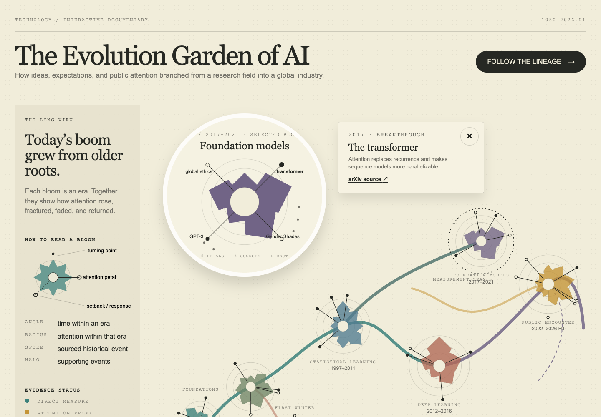

# AI Evolution Garden

**[View live dashboard →](https://phoebefu6.github.io/design-dashboard-with-phoebe/Technology/ai-industry-evolution-atlas/)**

[](https://phoebefu6.github.io/design-dashboard-with-phoebe/Technology/ai-industry-evolution-atlas/)

An interactive editorial flower map tracing the cycles that shaped artificial intelligence from 1950 through 2026 H1. Seven radial blooms connect breakthroughs and adoption with winters, harms, backlash, and governance responses.

## What it shows

- A complete desktop lineage with seven source-backed era blooms.
- A one-bloom-at-a-time mobile composition with previous and next controls.
- Petals encoding the contour of attention within an era, never across incompatible source methods.
- Filled event endpoints for breakthroughs or adoption and hollow endpoints for setbacks, harms, backlash, or governance.
- Click, touch, and keyboard selection with shareable `?era=` and `?event=` URL state.
- Event evidence opens beside the desktop bloom in a reserved upper information area (and below it on mobile) and can be dismissed with its close button, a second spoke selection, an outside click, or Escape.
- Documentary chapters, adjacent source notes, a long description, reduced-motion behavior, and print styles.

## Evidence model

Historical blooms from 1950–2016 use the case-insensitive frequency of “artificial intelligence” in the English Google Books Ngram corpus. The 2017–2026 H1 blooms use English Wikipedia user pageviews for the Artificial intelligence article. Petal values are min–max normalized independently inside each era.

These sources are deliberately separated: book frequency is a published-language attention proxy, while pageviews are direct page-request counts and a knowledge-seeking proxy. They do not form one continuous public-interest index. Stanford AI Index opinion figures appear only as separate survey context. The 2026 observation covers January–June.

The event map uses primary sources where practical and the European Commission Joint Research Centre’s AI Watch historical synthesis for broader periodization. It is an editorial selection, not an exhaustive history.

## Rebuild and test

From the repository root:

```bash
python3 Technology/ai-industry-evolution-atlas/scripts/build_data.py
python3 -m unittest Technology/ai-industry-evolution-atlas/tests/test_data.py
python3 -m http.server 8000
```

Then open `http://localhost:8000/Technology/ai-industry-evolution-atlas/` for local development. The client-facing deliverable is the live link above.

## Source snapshots

- [Google Books Ngram documentation](https://books.google.com/ngrams/info)
- [Wikimedia Analytics API documentation](https://doc.wikimedia.org/generated-data-platform/aqs/analytics-api/)
- [European Commission AI Watch historical evolution report](https://ai-watch.ec.europa.eu/publications/historical-evolution-artificial-intelligence_en)
- [Stanford HAI 2026 AI Index public opinion chapter](https://hai.stanford.edu/ai-index/2026-ai-index-report/public-opinion)

Raw API responses are checked into `data/raw/`; `scripts/build_data.py` deterministically creates the validated display dataset in `data/dashboard.json`.
